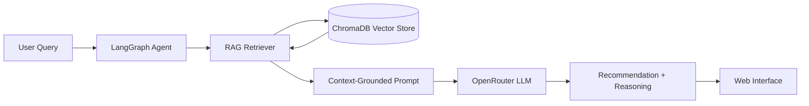

<div align="center">

# 💊 Medicine & Diabetes Assistant

### An AI-powered clinical decision-support agent for medicine and dosage guidance

[](https://www.python.org/)
[](https://www.langchain.com/langgraph)
[](https://www.trychroma.com/)
[](https://openrouter.ai/)
[](https://www.docker.com/)
[](./LICENSE)

*Helping clinicians make faster, safer, evidence-backed medicine and dosage decisions.*

[Overview](#-overview) • [Features](#-key-features) • [How It Works](#-how-it-works) • [Getting Started](#-getting-started) • [Project Structure](#-project-structure) • [Team](#-team)

</div>

---

##  Overview

**Medicine Assistant** is an intelligent agent that supports clinicians in selecting appropriate **medicines and dosages**, with a focus on **diabetes care**. It combines a **LangGraph-based reasoning agent** with a **Retrieval-Augmented Generation (RAG)** pipeline, using **ChromaDB** as a vector store and **OpenRouter** LLMs for reasoning, so recommendations are grounded in retrieved medical reference data rather than model guesswork alone.

Instead of relying purely on an LLM's internal knowledge (which can be outdated or hallucinated), the agent retrieves relevant, trusted context first, then reasons over it step by step to produce a transparent, traceable recommendation.

> ⚠️ **Disclaimer:** This project is a decision-support and educational tool. It is **not** a substitute for professional medical judgment, diagnosis, or treatment. Always consult a qualified healthcare provider.

---

##  Key Features

| | |
|---|---|
|  **LangGraph Agent** | Structured, stateful, multi-step reasoning pipeline instead of a single black-box prompt |
|  **RAG-Powered Retrieval** | Grounded, citation-friendly answers using ChromaDB vector search over medical references |
|  **Flexible LLM Access** | Swap between models via OpenRouter without changing application code |
|  **Web Interface** | Lightweight, accessible web app for interactive querying |
|  **Containerized** | Fully Dockerized for consistent, reproducible deployment anywhere |
|  **Configurable Pipeline** | Centralized settings for model choice, chunk size, and retrieval depth (top-k) |
|  **Test Coverage** | Dedicated test suite to validate agent and retrieval behavior |

---

##  How It Works



1. **Query intake**: the user submits a medicine or dosage question through the web interface.
2. **Agent orchestration**: the LangGraph agent manages state and decides what information is needed.
3. **Retrieval**: relevant chunks are pulled from ChromaDB based on semantic similarity.
4. **Grounded generation**: the retrieved context is passed to the LLM via OpenRouter to produce a well-supported answer.
5. **Response**: the final recommendation and reasoning are returned to the user.

---

##  Tech Stack

| Layer | Technology |
|---|---|
| Language | Python 3.10 |
| Agent Framework | LangGraph |
| Retrieval | ChromaDB (vector search) |
| LLM Access | OpenRouter |
| Frontend Tooling | Node.js, Tailwind CSS |
| Deployment | Docker, Docker Compose |
| Testing | Pytest |

---

##  Getting Started

### Prerequisites
- [Conda](https://docs.conda.io/) (recommended) or a Python 3.10 virtual environment
- An [OpenRouter](https://openrouter.ai/) API key
- Docker (optional, for containerized setup)

### 1. Clone the repository
```bash
git clone https://github.com/Salma-Talat-Shaheen/Medicine-Diabetes-Assistant.git
cd Medicine-Diabetes-Assistant
```

### 2. Create and activate the environment
```bash
conda create -n medicine-assistant python=3.10 -y
conda activate medicine-assistant
```

### 3. Install dependencies
```bash
pip install -e .
pip install -e ".[dev]"
```

### 4. Configure environment variables
```bash
cp .env.example .env
```
Then open `.env` and set your `OPENROUTER_API_KEY`. Additional settings (model name, chunk size, top-k retrieval) can be tuned in `src/config.py`.

### 5. Run the app
```bash
python src/web/app.py
```

### 🐳 Or run with Docker
```bash
docker-compose up --build
```

---

##  Project Structure

```
Medicine-Diabetes-Assistant/
├── chroma_db/             # Vector database storage
├── medicine-assistant/    # Core application package
├── scripts/               # Utility & setup scripts
├── src/
│   ├── agent.py           # LangGraph agent definition
│   ├── config.py          # Central configuration (model, chunking, top-k)
│   ├── llm.py             # LLM provider integration (OpenRouter)
│   ├── main.py            # Application entry point
│   ├── rag.py             # RAG pipeline (retrieval + generation)
│   ├── state.py           # Agent state management
│   └── web/app.py         # Web application entry point
├── tests/                 # Test suite
├── Dockerfile
├── docker-compose.yml
├── requirements.txt
├── pyproject.toml
└── LICENSE
```

---

##  Testing

```bash
pytest tests/
```

---


##  Team

This project was built with dedication by:

| Contributor | Rule |
|---|---|
| **Salma Shaheen** | Development |
| **Hebatallah AbuHarb** | Development |
| **Zahraa Alderawi** | Development |

---

##  License

This project is licensed under the **MIT License** — see the [LICENSE](./LICENSE) file for details.

---

<div align="center">

⭐ If you find this project useful, consider giving it a star!

</div>
